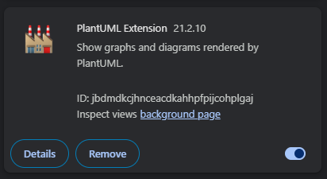

# PlantUML Usage

Go back to [root docs](../README.md).

## Visualization

### VS Code

You can use VSCode to visualize the documentation and diagrams.
Install the following:

1. [Java](https://java.com/en/download/)
1. [Graphviz](http://www.graphviz.org/download/)
1. VSCode Extension: `Markdown Preview Enhanced`
    1. You can render PLantUML with MPE using a server or local JAR
    1. For a local JAR mode, download the latest plantuml JAR from [here](https://plantuml.com/download). Then, set the path to that in the vscode user settings (`markdown-preview-enhanced.plantumlJarPath`)
    1. Read more details [here](https://github.com/shd101wyy/vscode-markdown-preview-enhanced/issues/1738).
1. VSCode Extension: PlantUML

To preview a `.md` markdown file, use the top right icon button to open the markdown enhanced preview.
Alternatively, the keyboard shortcut `Ctrl+K, V` should open it as well.

> NOTE: you can configure the Markdown Preview Enhanced extension to display content in a theme of your preference (e.g. dark theme)

> NOTE: a restart after installation can help if there are rendering issues

### Google Chrome

1. You can use this Google Chrome extension to render PlantUML inside the browser, called `PLantUML Extension`:
    

## Docs

1. [Theme Samples](theme/index.md)
1. [Usage Samples](samples/index.md)
